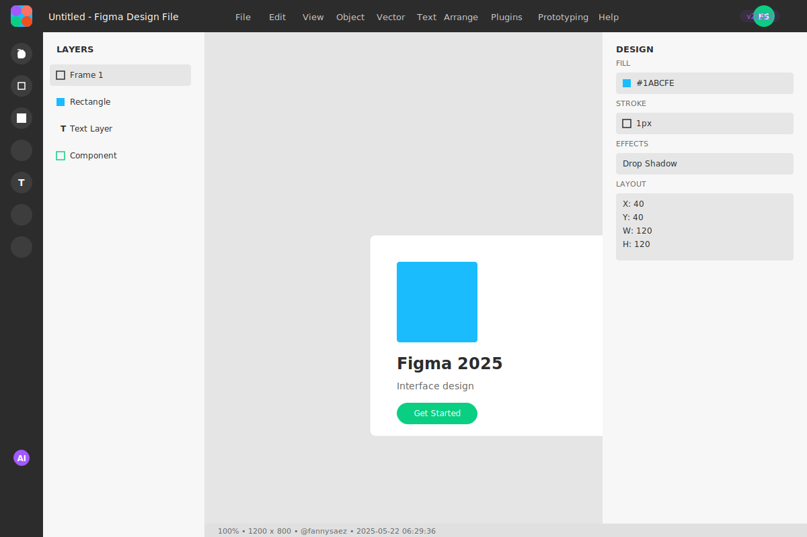
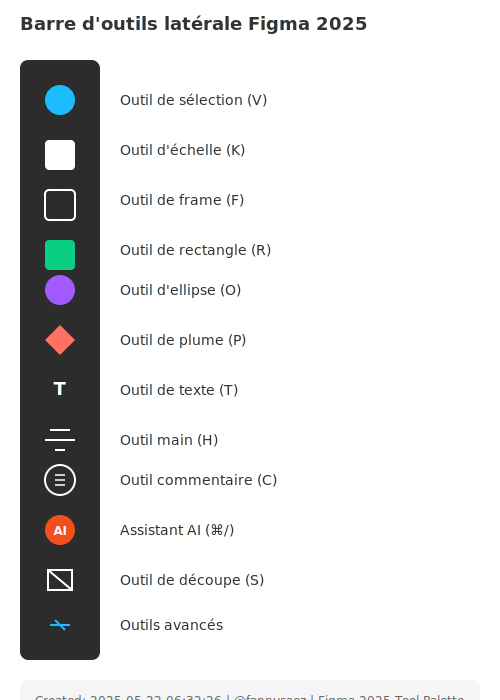
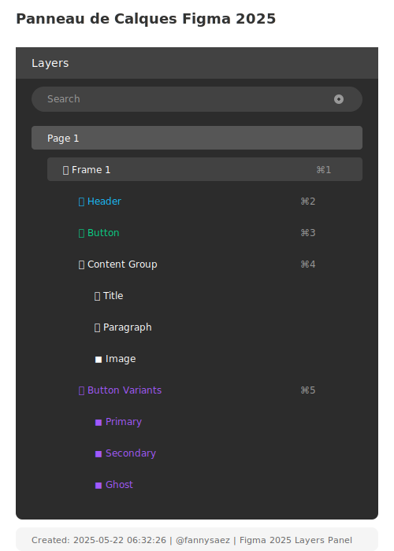
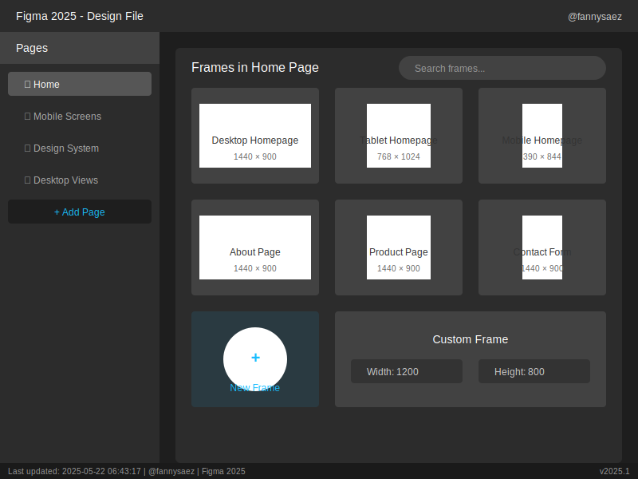

# Interface de Figma

  

 

Comprendre l'interface est essentiel avant de commencer :

- **Barre d'outils latérale (à gauche)** : Contient les outils de création comme le rectangle, le texte, etc.

  

 

- **Propriétés (à droite)** : Permet d'ajuster les propriétés de l'élément sélectionné

<!-- 

  

 -->

 

- **Calques (à gauche)** : Montre la hiérarchie des éléments de votre design

  

 

- **Pages et frames** : Organisent votre travail en différentes sections

  

---