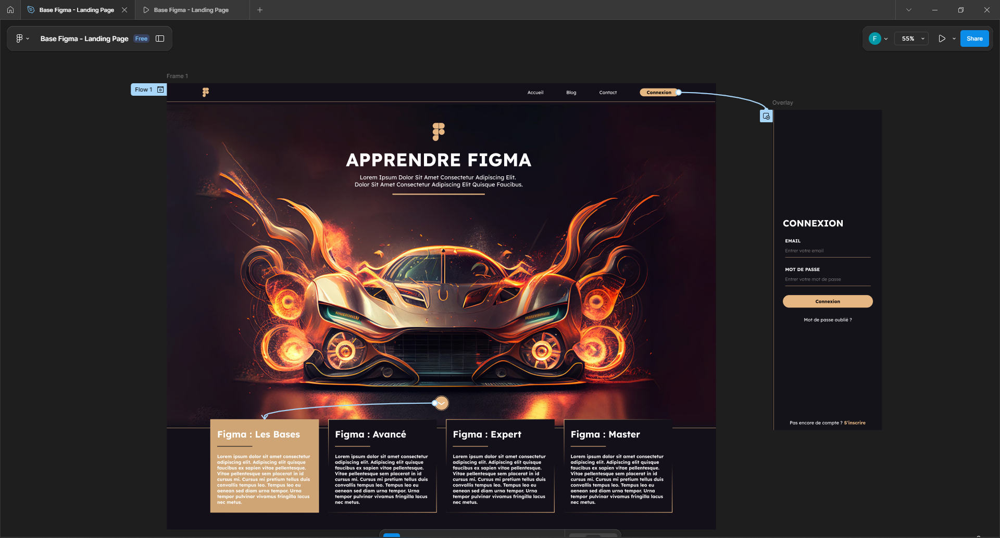

<div align="center">
  


  # Guide Complet d'Initiation à Figma - Création d'une Landing Page


*Un guide détaillé pour maîtriser Figma de zéro*

[](https://www.figma.com/)
[](https://www.figma.com/)
[](https://www.figma.com/)



  </div>

---

## Table des matières

- [Introduction](./Guide-Figma/Introduction.md)
- [Prérequis](./Guide-Figma/Introduction.md)
- [Installation et configuration](./Guide-Figma/Introduction.md)
- [Interface de Figma](./Guide-Figma/Interface.md)
- [Création d'une Landing Page](#./Guide-Figma/LandingPage.md)
  - [Structure de base](#./Guide-Figma/LandingPage.md)
  - [Design du header](#./Guide-Figma/LandingPage.md)
  - [Section héros](#./Guide-Figma/LandingPage.md)
  - [Sections informatives](#./Guide-Figma/LandingPage.md)
  - [Formulaire de connexion](#./Guide-Figma/LandingPage.md)
  - [Footer](#./Guide-Figma/LandingPage.md)
- [Composants et styles](#./Guide-Figma/Composants.md)
- [Prototypage](#./Guide-Figma/Prototypage.md)
- [Exportation](#./Guide-Figma/Exportation.md)
- [Collaboration](#./Guide-Figma/Collaboration.md)
- [Ressources additionnelles](#./Guide-Figma/Ressources.md)

---

```bash
📁 Figma
│── 📄 README.md           
├── 🖼️ Logo & Illustration
│   ├── Logo SVG centré
│   ├── Badges Figma / Design / Prototyping
│   └── Illustration d’aperçu (landing page validée)
├── 📝 Introduction
│   └── Présentation du guide et de ses objectifs (avec lien vers le tutoriel vidéo)
├── 📑 Table des matières
│   └── Liens internes vers les sections principales du guide
├── 🧰 Prérequis
│   └── Liste du matériel et des comptes nécessaires (ordinateur, navigateur, compte Figma)
├── ⚙️ Installation et configuration
│   ├── Création d’un compte Figma
│   ├── Utilisation via navigateur ou application
│   └── Création du premier fichier projet
├── 🖥️ Interface de Figma
│   └── Description de l’interface utilisateur : outils, calques, propriétés
├── 🎨 Création d’une Landing Page
│   ├── 📐 Structure de base
│   │   ├── Création d’un frame
│   │   └── Mise en place de la grille de mise en page
│   ├── 🧭 Design du header
│   │   ├── Barre de navigation
│   │   ├── Ajout du logo
│   │   ├── Menu de navigation
│   │   └── Bouton de connexion
│   ├── 🦸 Section héros
│   │   ├── Arrière-plan
│   │   ├── Titre principal
│   │   ├── Sous-titre
│   │   └── Image principale
│   ├── 🧾 Sections informatives
│   │   ├── Cartes de niveau (Bases, Avancé, Expert, Master)
│   │   └── Contenu de chaque carte (titre, texte, icônes)
│   ├── 🔐 Formulaire de connexion
│   │   ├── Panneau / bloc formulaire
│   │   ├── Titre du formulaire
│   │   ├── Champs Email & Mot de passe
│   │   ├── Bouton de connexion
│   │   └── Lien de récupération
│   └── 📎 Footer
│       ├── Zone de fond sombre
│       ├── Logo à gauche
│       ├── Liens au centre
│       └── Réseaux sociaux à droite
├── 🧩 Composants et styles
│   └── Création et gestion de styles (couleurs, textes, effets)
├── 🧪 Prototypage
│   └── Connexion des frames, interactions, animations
├── 📤 Exportation
│   └── Formats disponibles et options d’exportation (PNG, SVG, PDF, code)
├── 🤝 Collaboration
│   └── Partage, commentaires, travail en équipe sur Figma
├── 📚 Ressources additionnelles
│   └── Liens vers ressources utiles, templates, bibliothèques
```

---

<p align="center">
  <a href="Guide-Figma/Introduction.md">Suivant</a>
</p>


